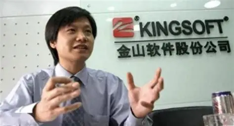
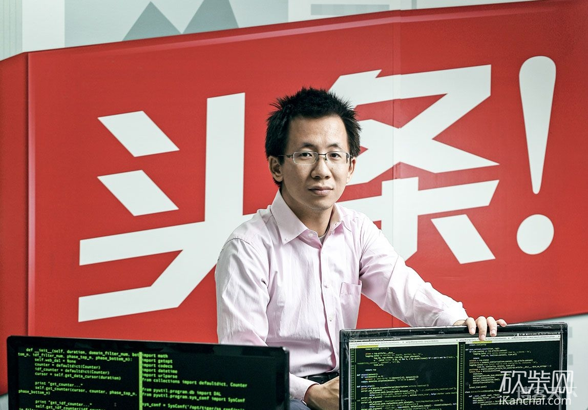

--- 
lang: zh-CN
layout: doc
outline: [2,3]
next:
  text: 'BitEagle新的学习成果'
  link: '/inspire/待更新~'

title: 思维重构：雷军与张一鸣带来的认知进化论
titleTemplate: BitEagle · Horizon
description: "一篇针对 BitEagle 的深度调研：结合我过往千人演讲的经历，解析如何将雷军的'顺势'与张一鸣的'算法'思维应用于创业与业务增长"

head:
  - - meta
    - name: keywords
      content: 雷军, 张一鸣, 深度调研, 创业思维, 认知迭代, 全栈开发, BitEagle, 比特鹰, 长期主义
  - - meta
    - name: description
      content: "代码之外的算力：在雷军的'极客浪漫'与张一鸣的'理性暴力'之间，寻找属于 BitEagle 的第三种解法。关于韧性、算法与长期主义的认知突围。创业大佬调研学习"
---

# 创业者笔记：
# 雷军与张一鸣带来的认知进化
---

本调研文章旨在对中国互联网产业两位标志性人物 —— **雷军与张一鸣** —— 在其职业生涯早期的关键转折点进行深度剖析。涵盖了雷军在1996年遭遇的金山“盘古”软件溃败后崛起，以及张一鸣在2006至2009年间于酷讯和饭否的早期职业成长。

| 对比维度 | 雷军 | 张一鸣 |
| :--- | :--- | :--- |
| **现任身份** | 小米集团创始人、董事长兼CEO | 字节跳动创始人 |
| **财富值** | 约 368 亿美元  | 约 693 亿美元 (福布斯中国内地富豪榜) |
| **核心产品** | WPS、小米手机/HyperOS、小米SU7 | 今日头条、抖音 (TikTok)、飞书 (Lark) |
| **人物特点** | **“厚道”的劳模**：极度勤奋，营销大佬 | **冷静的“机器”**：极度理性，专注长期目标 |
| **底层思维** | **顺势而为** (从逆势死磕到借势起飞) | **第一性原理** (延迟满足，追求长期最优解) |
| **面对困境的破局** | **结盟模式**：建立生态链，通过口碑汇聚人心 | **算法模式**：优化组织效率，通过数据寻找最优路径 |
| **最值得学习的品质** | **韧性**：盘古失败后重头再来的勇气 | **克制**：不被短期利益诱惑，坚持正确的事 |

## 一、 雷军：从“盘古”之痛到“顺势”哲学
雷军并非生来就信奉“风口论”。相反，早期的雷军是典型的“人定胜天”信奉者。

### 1. 1996年的转折点：勤奋的失效
1996 年是雷军思维模式发生剧烈震荡的一年。当时，他带领金山团队闭关三年，每天工作 16 小时，研发“盘古”组件，试图挑战微软 Office。然而，这款承载了无数心血的产品上市后销量惨淡,不到预期的百分之十。

这次失败给雷军带来了巨大的冲击：为什么战术上的极致勤奋，掩盖不了战略上的失效？

### 2. 思维重构：顺势与口碑
在长达半年的反思期后，雷军意识到光有技术不够，必须尊重市场规律、用户真实需求。这一时期，他的核心认知发生了两个质变：

从“死磕技术”到“顺势”： 他意识到不应在逆风中通过蛮力改变环境，而应寻找快速增长的风口。

从“营销轰炸”到“口碑为王”： 开始推崇 **“超预期”** 的产品体验，利用用户的主动传播来打破壁垒。

**《电脑入门》**这款技术要求远低于盘古的软件，就是在雷总反复接触到用户需求时快速做出的产品，直接上了畅销榜单！这时候大佬得出一个新的启发： 技术深度 ≠ 市场高度。 这直接导向了他后来创立小米时对移动互联网爆发期的精准切入。

<!-- [图片占位：此处建议插入一张雷军早期金山时期或“盘古”软件相关的历史照片，体现年代感与挫折感] -->

我的思考与验证： 雷军对“口碑”的执着启发了我。看着雷总在舞台和互联网不断的演讲，我也在大学期间担任千人开发者大会的主讲人，在准备过程中我发现，唯有真诚、超预期的内容分享才能赢得认可。那次经历让我确信，技术人员的影响力本质上建立在“利他”的口碑之上。

## 二、 张一鸣：在酷讯与饭否中的“算法”雏形
不同于雷军的“悟道”，张一鸣的成长路径更像是一台机器的自我迭代。

### 1. 酷讯时期的早期验证：解决信息效率
2006 年，迎来了Web 2.0的爆发期,张一鸣加入办公室简陋的 **酷讯**。当时很多人买火车票难，他利用编程技术写了一个小程序，一旦有新票就自动短信通知。这个小工具帮他解决了实际问题，也让他萌生了核心理念：信息的价值在于“分发效率”，而非仅仅是“生产信息”。

他发现，用户不缺信息，缺的是“在对的时间看到对的信息”。

### 2. 饭否时期的观察：延迟满足与理性决策
在饭否（中国早期的 Twitter）工作期间，张一鸣通过观察海量数据流，确立了“理性决策”的风格。他极度推崇“延迟满足感”，这在他后来的决策中反复体现：不被短期的诱惑（如早期的收购）打断，坚定地投入资源去优化推荐引擎这一核心资产。

他解决问题的方式不是靠人脉或资源堆砌，而是回到事物本质，寻找更优的解法。

## 三、 困境处理模式的对比分析
在面对增长瓶颈或困境时，两人的处理方式展现了两种创业者的典型路径：

雷军（创伤型）： 雷军的成长是由巨大的负面事件驱动的。盘古的失败打碎了他的旧世界，他是在废墟上重建。这种经历赋予了他一种悲剧英雄的气质和极度的危机感。他在小米推行的“极致、口碑、快”七字诀，本质上是防止再次陷入盘古式失败的防御机制。

张一鸣（迭代型）： 张一鸣的成长路径中没有毁灭性的个人失败。酷讯和饭否对他来说更像是两个尚未跑通的模型参数。他像训练大模型一样训练自己的职业生涯：在酷讯、饭否不断学习反思，发现社交分发的局限，以今日头条这个成功项目展开：
创办两年的公司能估值 **30亿** 人民币，融资没有大规模路演、没写PPT，而是通过一个 “大范围改变用户的实际效果、产生巨大社会价值”为核心，

要能让投资人有兴奋的参与感，比如从开个高利润饭店 -> **有机会改变全球用户获取信息方式** 就有巨大的吸引力了，
**个人的可行度，执行力，能聚合到一批优秀的团队** 三要素是创业成功的关键。

## 四、 总结与启发
深度调研这两位前辈的成长史，对我而言是一次认知的祛魅与重建。

关于成长： 无论雷军的逆境重生，还是张一鸣的线性增长，核心都在于认知的迭代速度。技术只是工具，对业务本质的理解才是壁垒。

关于行动： 作为一名全栈开发者，我不仅要打磨开发的硬技能，更要学习雷军的“用户思维”去交付有温度的产品，学习张一鸣的“理性思维”去优化业务流程。

::: details 点我展开 tips
1. 失败的复利： 
像雷军一样，将失败转化为认知的深度重构，是顶级企业家的核心能力。不要白白浪费一次危机。

2. 视角的升维： 
像张一鸣一样，跳出具体岗位的限制，从系统的角度去思考业务（如在酷讯修销售的Bug），是实现职业跃迁的唯一路径。

3. 顺势与造势： 
所有的技术创新，最终都必须回答一个问题——它是否为用户群体的高频痛点？
:::

## Contact - 联系我

微信添加 <a style="color:#3dd68c">zhrmghwsa</a> ，请备注可以优先通过哦~

也可邮件联系： *asiaPNRP@outlook.com*